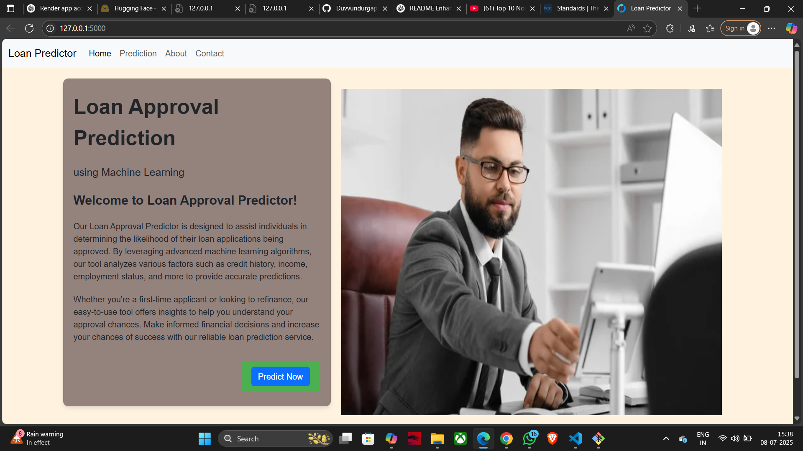

<<<<<<< HEAD
```markdown
=======
>>>>>>> origin/main
# Loan Prediction Web Application

This is a web application built using **Flask** that predicts whether a loan application will be **approved** or **rejected** based on user input. The model uses a **Random Forest** classifier trained on real-world features to predict loan approval status.

---

## Why This Project?

This project demonstrates practical, end-to-end skills in:
- ML model development using **scikit-learn**
- **Backend integration** with Flask
- Building **deployable**, database-driven applications
- **Front-end templating** and user experience design
- **Data storage** and management using SQLite
- Clean **Git version control** and modular project structure

Perfect for showcasing applied data science and web development in action.

---



---

## Features

- User-friendly form for inputting applicant details
- Real-time loan approval prediction using a trained model
- Contact page for user messages and feedback
- SQLite database to store prediction logs and contact messages
- Responsive front-end using Bootstrap

---

## Technologies Used

- **Flask** – Lightweight Python web framework
- **scikit-learn** – For building and using the ML model
- **SQLite** – For storing application data
- **HTML/CSS & Bootstrap** – For front-end styling and layout
- **joblib** – For model serialization

---

## Project Structure

```

/loan\_prediction
│
├── /static
│   ├── /images            # App images (e.g., Approved/Rejected visuals)
│   └── style.css          # Custom styles
│
├── /templates
│   ├── home\_page.html     # Home page
│   ├── about\_page.html    # About the app
│   ├── contact\_page.html  # Contact form
│   ├── predict.html       # Prediction input form
│   └── index.html         # Prediction results display
│
├── app.py                 # Main Flask app
├── schema.sql             # SQL script to set up DB tables
├── random\_forest\_model.pkl # Trained ML model
└── README.md              # This file

````

---

## ⚙️ Setup Instructions

### 1. Clone the Repository

```bash
git clone https://github.com/your-username/loan_prediction.git
cd loan_prediction
````

### 2. (Optional) Create a Virtual Environment

```bash
python -m venv myenv
source myenv/bin/activate  # On Windows: myenv\Scripts\activate
```

### 3. Upgrade pip and Install Dependencies

```bash
python -m pip install --upgrade pip
pip install -r requirements.txt
```

### 4. Create the SQLite Database

You can either:

* Run the app once to trigger table creation, **or**
* Manually run the `create_tables()` function from `app.py`

### 5. Start the Flask App

```bash
python app.py
```

Visit: `http://127.0.0.1:5000/` in your browser.

---

## How to Use

1. Navigate to the **Home Page** and input applicant details.
2. Submit the form to get a prediction: **Approved** or **Rejected**.
3. Optional: Use the **Contact Page** to send feedback or messages.

---

## Database Structure

### `loan_predictions` Table

| Column               | Description                      |
| -------------------- | -------------------------------- |
| `id`                 | Auto-increment primary key       |
| `married`            | 0 or 1                           |
| `dependents`         | Integer                          |
| `education`          | 0 or 1                           |
| `applicant_income`   | Numeric                          |
| `coapplicant_income` | Numeric                          |
| `loan_amount`        | Numeric                          |
| `loan_amount_term`   | Loan term (months)               |
| `credit_history`     | 0.0 or 1.0                       |
| `gender_male`        | 0 or 1                           |
| `self_employed`      | 0 or 1                           |
| `property_area_*`    | One-hot encoded location flags   |
| `total_income`       | Sum of applicant and coapplicant |
| `prediction`         | “Approved” or “Rejected”         |

### `contact_messages` Table

| Column      | Description                |
| ----------- | -------------------------- |
| `id`        | Auto-increment primary key |
| `name`      | Name of the sender         |
| `email`     | Email of the sender        |
| `message`   | Submitted message content  |
| `timestamp` | Submission date/time       |

---

## File Tracking Note

Model and database files like `random_forest_model.pkl` and `.db` are **intentionally tracked** in this repo to ensure the app runs out of the box locally.
For production, consider:

* Moving models to cloud storage (e.g., S3)
* Using **data versioning tools** like DVC

---

## Contributing

Have suggestions or improvements? Feel free to fork the repo and submit a pull request. We welcome:

* Bug fixes
* Feature enhancements
* UI/UX upgrades
* Better model performance

---

## License

This project is licensed under the MIT License. See the [LICENSE](LICENSE) file for details.

```

---

Let me know if you’d like to:
- Add **LinkedIn-optimized language** for showcasing this project
- Turn this into a **portfolio case study**
- Write a **blog post** around it for Medium or Hashnode

This is a great project already—you’re just a few tweaks away from making it *shine* for recruiters or collaborators.
```
